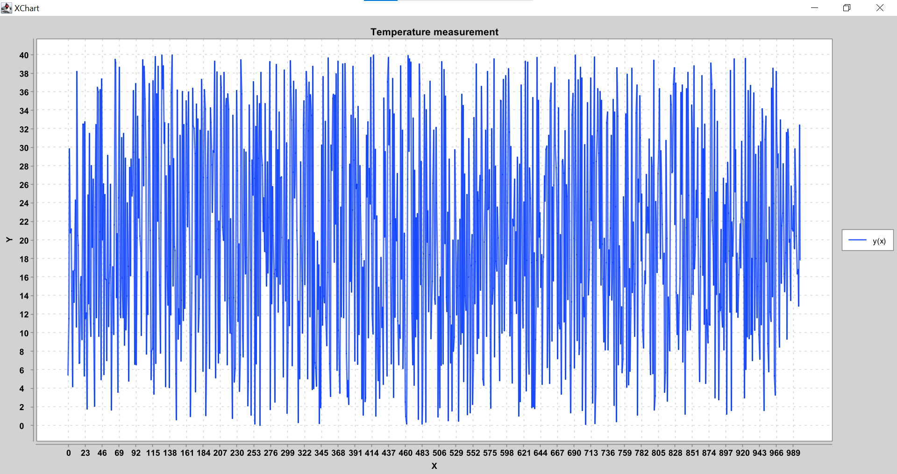

## Клиент для Rest_Api_Measurements
### Имеет 5 методов:

- authReg()             - регистрация нового пользователя.
- sensorRegistration()  - регистрация сенсора.
- addMeasurements()     - добавление 1000 случайных измерений.
- get1000Measurements() - получение всех измерений в консоли, а также графика изменения температур.
- getRainyDays()        - получение количества дождливых дней.

